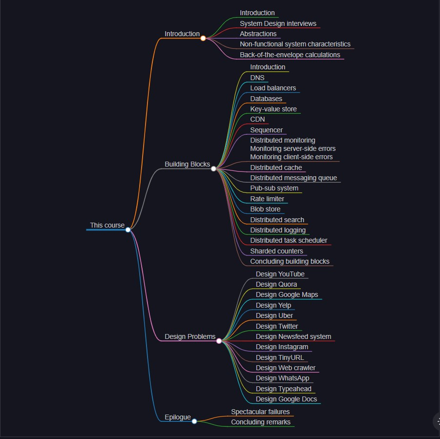

# 📐 High-Level System Design — Complete Folder Analysis

<div align="center">

**A comprehensive analysis of all content present in the high-level design folder**




</div>

---

## 📋 Table of Contents

- [📂 Folder Overview](#-folder-overview)
- [🧭 What is System Design?](#-what-is-system-design)
- [⚡ Non-Functional System Characteristics](#-non-functional-system-characteristics)
- [🧱 Building Blocks (16 Components)](#-building-blocks-16-components)
- [🔧 The RESHADED Approach](#-the-reshaded-approach)
- [🗄️ Databases](#-databases)
- [🔬 Abstractions](#-abstractions)
- [🧮 Back-of-the-Envelope Calculations](#-back-of-the-envelope-calculations)
- [💥 Spectacular Failures](#-spectacular-failures)
- [🏛️ Design Case Studies](#-design-case-studies)
- [🌍 Real-World System Designs](#-real-world-system-designs)
- [📑 Complete Folder Structure](#-complete-folder-structure)

---

## 📂 Folder Overview

The folder at `/Users/avinash/Documents/development/java-starter-kit/educational-resources/system-design/high-level-design/` contains comprehensive educational content on **High-Level System Design** originally from the "Grokking Modern System Design Interview" course. The content is organized into:

| Section | Count | Description |
|:--------|:-----:|:------------|
| **Introduction** | 1 folder | What is System Design |
| **Non-functional Characteristics** | 5 topics | Availability, Fault Tolerance, Maintainability, Reliability, Scalability |
| **Building Blocks** | 16 topics | DNS, Load Balancers, Databases, KV Store, CDN, Sequencer, Monitoring, Caching, Messaging Queue, Pub-Sub, Rate Limiter, Blob Store, Search, Logging, Task Scheduler, Sharded Counters |
| **Design Case Studies** | 17 topics | Deep dives into each building block design |
| **Real-World System Designs** | 12 systems | YouTube, Quora, Google Maps, Yelp, Uber, Twitter, Newsfeed, Instagram, TinyURL, Web Crawler, WhatsApp, Typeahead, Google Docs |
| **Databases** | 5 topics | Introduction, Types, Partitioning, Replication, Trade-offs |
| **Abstractions** | 2 topics | Consistency Models, Failure Models |
| **Back-of-the-Envelope** | 2 topics | Resource Estimation, Numbers in Perspective |
| **Spectacular Failures** | 4 topics | Facebook Outage, AWS Kinesis, AWS Wide Spread, Introduction |
| **MkDocs Docs** | 1 folder | Documentation site with custom CSS/JS |

---

## 🧭 What is System Design?

> **System design** is the process of defining components and their integration, APIs, and data models to build large-scale systems that meet a specified set of functional and non-functional requirements.

### The Three Pillars

```
               Computer
               networking
              /        \
             /   System \
            /    Design  \
     Distributed--------Parallel
         Systems        Computing
```

### Goals of System Design

| Goal | Description |
|:-----|:------------|
| 🛡️ **Reliable** | Handle faults, failures, and errors gracefully without impacting end users |
| 🎯 **Effective** | Meet all user needs and business requirements while delivering expected functionality |
| 🔧 **Maintainable** | Flexible and easy to scale up or down. The ability to add new features comes under maintainability |

### Modern System Design Using Building Blocks

Modern system design follows a **bottom-up approach**. Instead of designing every system from scratch, we identify common patterns and reuse them as building blocks. This approach:

- ✅ **Reduces complexity** by separating concerns
- ✅ **Promotes reuse** of proven designs
- ✅ **Accelerates development** time
- ✅ **Improves reliability** through battle-tested components

---

## ⚡ Non-Functional System Characteristics

Non-functional requirements (NFRs) are criteria based on which a user considers a system usable. They include requirements like high availability, low latency, scalability, and so on.

### 1. Availability

**Formula:** `A (%) = (Total Time - Downtime) / Total Time × 100`

Measured as a ratio of uptime to total time. Expressed as "nines":

| Nines | Availability | Downtime per Year |
|:-----|:------------|:-----------------|
| 99% | Two nines | 87.6 hours |
| 99.9% | Three nines | 8.76 hours |
| 99.99% | Four nines | 52.56 minutes |
| 99.999% | Five nines | 5.26 minutes |

**Key considerations:**
- Different providers measure availability starting from different points
- Planned downtimes are typically excluded
- Downtime due to cyberattacks may not be incorporated

### 2. Fault Tolerance

> Fault tolerance refers to a system's ability to execute persistently even if one or more of its components fail.

**Key Techniques:**

| Technique | Description |
|:----------|:------------|
| **Replication** | Create multiple copies of data in separate storage. All copies update regularly for consistency. Trade-off: strong consistency reduces availability (CAP theorem) |
| **Checkpointing** | Saves system state in stable storage at consistent intervals. On failure, resume from last checkpoint |

**Synchronous vs Asynchronous Checkpointing:**
- **Consistent state**: No communication among processes during checkpointing
- **Inconsistent state**: Processes communicate during checkpointing, causing potential data loss on recovery

### 3. Maintainability

> Maintainability is the probability that a service will restore its functions within a specified time of fault occurrence.

**Three Aspects:**
- **Operability**: Ease of ensuring smooth operational running
- **Lucidity**: Simplicity of the code base
- **Modifiability**: Capability to integrate new and unforeseen features

**Metric:** MTTR (Mean Time To Repair)

```
MTTR = Total Maintenance Time / Total Number of Repairs
```

**Goal:** Keep MTTR as low as possible.

### 4. Reliability

> Reliability, R, is the probability that the service will perform its functions for a specified time.

**Metrics:**
```
MTBF = (Total Elapsed Time - Sum of Downtime) / Total Number of Failures
MTTR = Total Maintenance Time / Total Number of Repairs
```

| Scenario | Availability | Reliability | Desirability |
|:---------|:------------:|:-----------:|:------------:|
| Low A, Low R | ❌ | ❌ | Undesirable |
| Low A, High R | ❌ | ✅ | Rare |
| High A, Low R | ✅ | ❌ | Misleading |
| High A, High R | ✅ | ✅ | **Desirable** |

> Reliability (R) and availability (A) are distinct but related. Mathematically, A is a function of R. Availability is driven by time loss, while reliability is driven by frequency and impact of failures.

### 5. Scalability

> Scalability is the ability of a system to handle growing amounts of work by adding resources (horizontal or vertical scaling).

| Scaling Type | Description | Example |
|:------------|:------------|:--------|
| **Horizontal Scaling** | Add more machines/nodes | Adding more servers to a pool |
| **Vertical Scaling** | Upgrade existing machines | Increasing RAM/CPU of a server |

---

## 🧱 Building Blocks (16 Components)

The course covers **16 fundamental building blocks** that form the foundation for designing large-scale systems:

| # | Building Block | Core Purpose | Category |
|:-:|:---------------|:-------------|:---------|
| 1 | **Domain Name System (DNS)** | Hierarchical and distributed naming for internet-connected computers | Networking |
| 2 | **Load Balancers** | Fair distribution of client requests among available servers | Traffic Management |
| 3 | **Databases** | Store, retrieve, modify, and delete data with different processing procedures | Storage |
| 4 | **Key-Value Store** | Non-relational database storing data as key-value pairs with high scalability | Storage |
| 5 | **Content Delivery Network (CDN)** | Efficiently deliver content to end users while reducing latency | Networking |
| 6 | **Sequencer** | Unique ID generation with causality maintenance | Utility |
| 7 | **Service Monitoring** | System analysis and stakeholder alerting for distributed systems | Observability |
| 8 | **Distributed Caching** | Multiple cache servers coordinating to store frequently accessed data | Performance |
| 9 | **Distributed Messaging Queue** | Decouples producers and consumers for independent scalability | Communication |
| 10 | **Publish-Subscribe System** | Asynchronous service-to-service communication method | Communication |
| 11 | **Rate Limiter** | Throttles incoming requests based on predefined limits | Defense |
| 12 | **Blob Store** | Storage solution for unstructured data like multimedia files | Storage |
| 13 | **Distributed Search** | Three integral components: crawl, index, and search | Search |
| 14 | **Distributed Logging** | Scalable and reliable event logging for distributed systems | Observability |
| 15 | **Distributed Task Scheduling** | Mediates between tasks and resources with intelligent allocation | Orchestration |
| 16 | **Sharded Counters** | Efficient distributed counting for millions of concurrent requests | Utility |

### Design Convention for Each Building Block

Every building block design follows a consistent structure:

1. **Functional Requirements** — Features a user of the designed system will be able to use
2. **Non-Functional Requirements** — Criteria based on which a user considers the system usable
3. **API Design** — Interfaces for service interaction
4. **High-Level Design** — Main components and their interactions
5. **Detailed Design** — Evolution of design, addressing limitations
6. **Evaluation** — Effectiveness against requirements

---

## 🔧 The RESHADED Approach

The **RESHADED** approach is a structured methodology for solving any system design problem. It provides a high-level strategy that sets the tone for a good solution to any design problem.

### Advantages

- 🧠 **Memorable Framework**: Helps remember key steps for every design problem
- 📈 **Systematic Progress**: At any point, there is always a next step laid out ahead
- 🎯 **Complete Coverage**: Ensures all basic ingredients required to solve any design problem are addressed

### The 8 Steps

| Step | Name | Description |
|:----:|:-----|:------------|
| 1 | **📋 Requirements** | Gather all requirements and define scope. Understand the service, how it works, and its main features |
| 2 | **📏 Estimation** | Estimate resources required to provide the service to a defined number of users |
| 3 | **💾 Storage Schema** | Articulate the data model — define tables, fields, and relationships |
| 4 | **🏗️ High-level Design** | Identify main components and building blocks needed |
| 5 | **🔌 API Design** | Build interfaces for the service, translating requirements into concrete endpoints |
| 6 | **🔬 Detailed Design** | Recognize limitations of the high-level design and evolve it |
| 7 | **✅ Evaluation** | Measure effectiveness against functional and non-functional requirements |
| 8 | **✨ Distinctive Component** | Identify unique aspects specific to each design problem |

```
┌────────────────────────────────────────────────────────┐
│                    RESHADED Approach                    │
├────────────────────────────────────────────────────────┤
│  📋 Requirements → 📏 Estimation → 💾 Storage Schema    │
│                                                        │
│  🏗️ High-level Design → 🔌 API Design → 🔬 Detailed   │
│                                                        │
│  ✅ Evaluation → ✨ Distinctive Component               │
└────────────────────────────────────────────────────────┘
```

---

## 🗄️ Databases

### Introduction to Databases

Databases are systems that store, retrieve, modify, and delete data in connection with different data-processing procedures.

### Types of Databases

| Type | Examples | Use Case |
|:-----|:---------|:---------|
| **Relational (SQL)** | MySQL, PostgreSQL, Oracle | Structured data with relationships |
| **Document Stores** | MongoDB, CouchDB | Semi-structured data |
| **Wide-Column Stores** | Cassandra, HBase | Time-series, large-scale analytics |
| **Graph Databases** | Neo4j, Amazon Neptune | Highly connected data |
| **Time-Series Databases** | InfluxDB, TimescaleDB | Metrics, monitoring data |
| **Search Databases** | Elasticsearch | Full-text search |

### Data Replication

| Strategy | Description | Pros | Cons |
|:---------|:------------|:-----|:-----|
| **Leader-Follower** | One leader handles writes, followers replicate | Simple, consistent | Single point of failure for writes |
| **Multi-Leader** | Multiple nodes accept writes | High availability | Conflict resolution needed |
| **Leaderless** | Any node accepts writes | Max availability | Complex consistency |

### Data Partitioning

| Strategy | Description |
|:---------|:------------|
| **Horizontal (Sharding)** | Distribute rows across multiple servers |
| **Vertical** | Separate tables/columns across servers |
| **Directory-Based** | Use a lookup service to locate data |
| **Consistent Hashing** | Distribute data evenly with minimal reorganization |

### Trade-offs in Databases

| Trade-off | Description |
|:----------|:------------|
| **Consistency vs Availability** | CAP Theorem — choose 2 out of 3 (Consistency, Availability, Partition Tolerance) |
| **Read vs Write Performance** | Optimizing for one often sacrifices the other |
| **Strong vs Eventual Consistency** | Strong consistency limits throughput; eventual consistency allows stale reads |
| **Latency vs Durability** | Synchronous writes are slower but safer |

---

## 🔬 Abstractions

### Spectrum of Consistency Models

| Model | Guarantee | Use Case |
|:------|:----------|:---------|
| **Strong Consistency** | All reads see latest write immediately | Financial transactions |
| **Sequential Consistency** | Operations appear in program order | Distributed databases |
| **Causal Consistency** | Causally related operations seen in order | Collaborative editing |
| **Eventual Consistency** | All replicas converge given enough time | Social media feeds |
| **Weak Consistency** | No guarantees on update visibility | DNS caching |

### Spectrum of Failure Models

| Model | Behavior | Handling |
|:------|:---------|:---------|
| **Crash Failure** | Server stops responding completely | Replication, restart |
| **Omission Failure** | Server fails to respond | Timeouts, retries |
| **Timing Failure** | Response outside time interval | Circuit breakers |
| **Byzantine Failure** | Arbitrary or malicious behavior | Byzantine fault tolerance |
| **Arbitrary Failure** | Any type of misbehavior | Defense in depth |

---

## 🧮 Back-of-the-Envelope Calculations

### Numbers in Perspective

| Quantity | Approximate Value | Context |
|:---------|:-----------------:|:--------|
| 1 million seconds | ~11.6 days | Time for 1M requests at 1 req/sec |
| 1 billion seconds | ~31.7 years | 1B requests at 1 req/sec |
| Requests/sec for 1M DAU (10 actions/day) | ~115 req/sec | Small to medium service |
| Requests/sec for 500M DAU | ~57,000 req/sec | Major internet service |
| Single server capacity | ~10,000 req/sec (simple) | ~5-6 servers for 500M DAU |

### Resource Estimation Example

For a system serving **500M DAU**:
- **Requests per second**: Estimated based on user actions per day
- **Storage needed**: Calculated from data generated per user per day
- **Bandwidth**: Based on data transfer per request
- **Server count**: Derived from requests per second per server capacity

---

## 💥 Spectacular Failures

### Case Studies Covered

| Failure | Category | Root Cause | Key Lesson |
|:--------|:---------|:-----------|:-----------|
| **Facebook/WhatsApp/Instagram Outage (2021)** | Cascading | BGP route withdrawal took down DNS, entire ecosystem | Design for cascading failures; have rollback plans |
| **AWS Kinesis Outage** | Configuration | Throttling misconfiguration affected downstream services | Understand service dependencies |
| **AWS Wide Spread Outage** | Capacity | Auto-scaling failure during increased load | Test scaling mechanisms thoroughly |

### Categories of Failures

| Category | Description | Example |
|:---------|:------------|:--------|
| **Configuration Errors** | Misconfigured infrastructure/software | AWS S3 outage (2017) |
| **Capacity Failures** | Systems overwhelmed beyond designed capacity | Twitter Fail Whale era |
| **Software Bugs** | Code defects causing cascading failures | Knight Capital (2012) |
| **Cascading Failures** | One failure triggers a chain reaction | Northeast blackout (2003) |
| **Human Errors** | Operator mistakes during maintenance | GitLab database loss (2017) |

---

## 🏛️ Design Case Studies

Each building block has a detailed design case study:

| # | Building Block Design | Key Focus Areas |
|:-:|:---------------------|:----------------|
| 1 | **Distributed Cache** | Memcached vs Redis, eviction policies, consistent hashing |
| 2 | **Key-Value Store** | Scalability, durability, configurability, fault tolerance |
| 3 | **Distributed Messaging Queue** | Producer-consumer decoupling, ordering guarantees |
| 4 | **Distributed Search** | Web crawling, indexing, query serving at scale |
| 5 | **Distributed Task Scheduler** | Resource-task orchestration, priority scheduling |
| 6 | **Distributed Logging** | I/O optimization, centralized log aggregation |
| 7 | **Distributed Monitoring** | Metrics collection, alerting, dashboards |
| 8 | **Content Delivery Network (CDN)** | Edge caching, origin pull, geo-distribution |
| 9 | **Blob Store** | Unstructured data storage, replication, durability |
| 10 | **Domain Name System (DNS)** | Hierarchical design, caching, TTL strategies |
| 11 | **Load Balancer** | Algorithms (round-robin, least-connections), health checks |
| 12 | **Rate Limiter** | Token bucket, leaky bucket, sliding window |
| 13 | **Sequencer** | Snowflake IDs, UUIDs, database-based sequences |
| 14 | **Sharded Counters** | High-concurrency counting, conflict resolution |
| 15 | **Pub-Sub System** | Topics, subscriptions, push vs pull, fan-out |
| 16 | **Monitor Client-side Errors** | Error tracking, source maps, aggregation |
| 17 | **Monitor Server-side Errors** | Log analysis, anomaly detection, distributed tracing |

---

## 🌍 Real-World System Designs

| # | System | Distinctive Challenge | Key Building Blocks |
|:-:|:-------|:----------------------|:-------------------:|
| 1 | **YouTube** | Video streaming at global scale with custom data stores | Blob Store, CDN, Database, Caching |
| 2 | **Quora** | Vertical sharding of MySQL to meet demanding scalability | Database, Load Balancer, Caching |
| 3 | **Google Maps** | Map segmentation for spatial data delivery | Database, CDN, Caching, Load Balancer |
| 4 | **Yelp (Proximity Service)** | Quadtree-based data structures for spatial data | Database, Caching, Load Balancer |
| 5 | **Uber** | Fraud detection in payments, real-time driver-rider matching | Messaging Queue, Pub-Sub, Database, Caching |
| 6 | **Twitter** | Client-side load balancers for thousands of service instances | Load Balancer, Messaging Queue, Database, Caching |
| 7 | **Newsfeed System** | Recommendation systems for content ranking | Pub-Sub, Caching, Database, Task Scheduler |
| 8 | **Instagram** | Building blocks combination for scalable photo sharing | Blob Store, CDN, Database, Caching, Messaging Queue |
| 9 | **TinyURL** | Base-58 encoding for unique short URLs at scale | Database, Sequencer, Caching |
| 10 | **Web Crawler** | Detection and resolution of crawler traps at internet scale | Distributed Search, Task Scheduler, Blob Store |
| 11 | **WhatsApp** | Message management for billions including offline delivery | Messaging Queue, Database, Caching, Pub-Sub |
| 12 | **Typeahead Suggestion** | Efficient trie data structure for real-time suggestions | Caching, Database, Task Scheduler |
| 13 | **Google Docs** | Concurrency management with OT and CRDT for editing | Pub-Sub, Database, Messaging Queue |

---

## 📑 Complete Folder Structure

```
high-level-design/
│
├── 📄 COURSE_ANALYSIS.md           ← This file (complete folder analysis)
├── 📄 README.md                    ← Course overview in MkDocs format
├── 📄 mkdocs.yml                   ← MkDocs site configuration
├── 🖼️ system_design_course.jpg    ← Course header image
├── 🖼️ system_design_steps.jpg    ← System design methodology image
│
├── 📁 docs/                        ← MkDocs documentation site source
│   ├── 📄 index.md                 ← Home page with feature cards
│   ├── 📁 introduction/            ← Course introduction
│   ├── 📁 non-functional-system-characteristics/  ← 5 topics
│   ├── 📁 building-blocks/         ← 16 building blocks
│   ├── 📁 reshaded-approach/       ← RESHADED methodology (3 files)
│   ├── 📁 design-case-studies/     ← 17 design case studies
│   ├── 📁 real-world-designs/      ← 13 real-world designs
│   ├── 📁 abstractions/            ← Consistency & failure models
│   ├── 📁 back-of-the-envelope/    ← Resource estimation
│   ├── 📁 databases/              ← Database concepts
│   ├── 📁 spectacular-failures/    ← Famous failures
│   ├── 📁 concluding-remarks/     ← Course wrap-up
│   ├── 📁 stylesheets/            ← Custom CSS
│   ├── 📁 javascripts/            ← Custom JS
│   └── 📁 assets/images/          ← Image resources
│
├── 📁 Introduction/                ← What is System Design
│   └── 📄 README.md
│
├── 📁 Non-functional System Characteristics/
│   ├── 📁 Availability/            ← 📄 README.md + nine_availability.jpg
│   ├── 📁 Fault Tolerance/         ← 📄 README.md + checkpointing.jpg, replication.jpg
│   ├── 📁 Maintainability/         ← 📄 README.md
│   ├── 📁 Reliability/            ← 📄 README.md
│   └── 📁 Scalability/            ← 📄 README.md + scaling.jpg
│
├── 📁 Building Blocks/             ← Building blocks overview
│   ├── 📄 README.md
│   └── 🖼️ (16 building block images)
│
├── 📁 Domain Name System/          ← DNS content (2 topics)
│   ├── 📁 Introduction to Domain Name System (DNS)/
│   └── 📁 How the Domain Name System Works/
│
├── 📁 Load Balancer/               ← Load balancer content (3 topics)
│   ├── 📁 Introduction to Load Balancers/
│   ├── 📁 Global and Local Load Balancing/
│   └── 📁 Advanced Details of Load Balancers/
│
├── 📁 Databases/                   ← Database content (5 topics)
│   ├── 📁 Introduction to Databases/
│   ├── 📁 Types of Databases/
│   ├── 📁 Data Partitioning/
│   ├── 📁 Data Replication/
│   └── 📁 Trade-offs in Databases/
│
├── 📁 Key-value Store/             ← KV store content (5 topics)
│   ├── 📁 Design of a Key-value Store/
│   ├── 📁 Ensure Scalability and Replication/ (consistent hashing images)
│   ├── 📁 Versioning Data and Achieving Configurability/
│   ├── 📁 Enable Fault Tolerance and Failure Detection/ (Merkle tree images)
│   └── 📁 System Design The Key-value Store/
│
├── 📁 Content Delivery Network (CDN)/  ← CDN content (7 topics)
│   ├── 📁 Introduction to a CDN/
│   ├── 📁 Design of a CDN/
│   ├── 📁 In-depth Investigation of CDN Part 1/
│   ├── 📁 In-depth Investigation of CDN Part 2/
│   ├── 📁 Evaluation of CDN's Design/
│   ├── 📁 Quiz on CDN's Design/
│   └── 📁 System Design The CDN/
│
├── 📁 Sequencer/                   ← Unique ID generation (3 topics)
│   ├── 📁 Design of a Unique ID Generator/
│   ├── 📁 Unique IDs with Causality/ (Snowflake, TrueTime, Vector clocks)
│   └── 📁 System Design Sequencer/
│
├── 📁 Distributed Cache/           ← Caching content (6 topics)
│   ├── 📁 Background of Distributed Cache/
│   ├── 📁 High-level Design of a Distributed Cache/
│   ├── 📁 Detailed Design of a Distributed Cache/
│   ├── 📁 Evaluation/
│   ├── 📁 Memcached versus Redis/
│   └── 📁 System Design The Distributed Cache/
│
├── 📁 Distributed Messaging Queue/  ← Messaging queue (7 topics)
│   ├── 📁 Considerations/
│   ├── 📁 Design of a Distributed Messaging Queue Part 1/
│   ├── 📁 Design of a Distributed Messaging Queue Part 2/
│   ├── 📁 Evaluation/
│   ├── 📁 Quiz/
│   ├── 📁 Requirements/
│   └── 📁 System Design The Distributed Messaging Queue/
│
├── 📁 Pub-sub/                     ← Pub-sub (3 topics)
│   ├── 📁 Introduction to Pub-sub/
│   ├── 📁 Design of a Pub-sub System/ (broker architecture images)
│   └── 📁 System Design The Pub-sub Abstraction/
│
├── 📁 Rate Limiter/                ← Rate limiting (5 topics)
│   ├── 📁 Design of a Rate Limiter/
│   ├── 📁 Rate Limiter Algorithms/ (token bucket, leaking bucket, sliding window)
│   ├── 📁 Quiz/
│   ├── 📁 Requirements/
│   └── 📁 System Design The Rate Limiter/
│
├── 📁 Blob Store/                  ← Blob storage (6 topics)
│   ├── 📁 Design Considerations of a Blob Store/
│   ├── 📁 Design of a Blob Store/
│   ├── 📁 Evaluation/
│   ├── 📁 Quiz/
│   ├── 📁 Requirements/
│   └── 📁 System Design A Blob Store/
│
├── 📁 Distributed Search/          ← Search (6 topics)
│   ├── 📁 Design of a Distributed Search/
│   ├── 📁 Evaluation/
│   ├── 📁 Indexing in a Distributed Search/
│   ├── 📁 Requirements/
│   ├── 📁 Scaling Search and Indexing/
│   └── 📁 System Design The Distributed Search/
│
├── 📁 Distributed Logging/         ← Logging (3 topics)
│   ├── 📁 Design of a Distributed Logging Service/
│   ├── 📁 Introduction to Distributed Logging/
│   └── 📁 System Design Distributed Logging/
│
├── 📁 Distributed Task Scheduler/  ← Task scheduling (5 topics)
│   ├── 📁 Design Considerations/
│   ├── 📁 Design of a Distributed Task Scheduler/
│   ├── 📁 Evaluation/
│   ├── 📁 Requirements/
│   └── 📁 System Design The Distributed Task Scheduler/
│
├── 📁 Sharded Counters/            ← Sharded counters (4 topics)
│   ├── 📁 Detailed Design of Sharded Counters/
│   ├── 📁 High-level Design of Sharded Counters/
│   ├── 📁 Quiz/
│   └── 📁 System Design The Sharded Counters/
│
├── 📁 Distributed Monitoring/      ← Monitoring (3 topics)
│   ├── 📁 Introduction to Distributed Monitoring/ (15+ monitoring images)
│   ├── 📁 Prerequisites of a Monitoring System/
│   └── 📁 System Design Distributed Monitoring/
│
├── 📁 Monitor Client-side Errors/  ← Client monitoring (2 topics)
│   ├── 📁 Focus on Client-side Errors/
│   └── 📁 Design of a Client-side Monitoring System/
│
├── 📁 Monitor Server-side Errors/  ← Server monitoring (3 topics)
│   ├── 📁 Design of a Blob Store/
│   ├── 📁 Detailed Design of a Monitoring System/
│   └── 📁 Visualize Data in a Monitoring System/
│
├── 📁 Abstractions/                ← Abstraction topics (2 topics)
│   ├── 📁 Spectrum of Consistency Models/
│   └── 📁 The Spectrum of Failure Models/
│
├── 📁 Back-of-the-envelope Calculations/  ← Estimation (2 topics)
│   ├── 📁 Example of Resource Estimation/
│   └── 📁 Put Back-of-the-envelope Numbers in Perspective/
│
├── 📁 Spectacular Failures/        ← System failures (4 topics)
│   ├── 📁 Introduction to Distributed System Failures/
│   ├── 📁 Facebook, WhatsApp, Instagram, Oculus Outage/
│   ├── 📁 AWS Kinesis Outage Affecting Many Organizations/
│   └── 📁 AWS Wide Spread Outage/
│
├── 📁 Concluding Remarks/          ← Course conclusion
│   └── 📄 README.md
│
├── 📁 Concluding the Building Blocks Discussion/  ← Building blocks wrap-up
│   ├── 📁 The RESHADED Approach for System Design/
│   └── 📁 Wrapping Up the Building Blocks Discussion/
│
├── 📁 Design a Proximity Service Yelp/       ← Yelp (5 topics)
├── 📁 Design a URL Shortening Service TinyURL/   ← TinyURL (6 topics)
├── 📁 Design Collaborative Document Editing Service Google Docs/ ← Google Docs (5 topics)
├── 📁 Design Google Maps/                    ← Google Maps (6 topics)
├── 📁 Design Instagram/                      ← Instagram (5 topics)
├── 📁 Design Newsfeed System/                ← Newsfeed (4 topics)
├── 📁 Design Quora/                          ← Quora (5 topics)
├── 📁 Design Twitter/                        ← Twitter (6 topics)
├── 📁 Design Typeahead Suggestion/           ← Typeahead (7 topics)
├── 📁 Design Uber/                           ← Uber (7 topics)
├── 📁 Design WhatsApp/                       ← WhatsApp (6 topics)
├── 📁 Design Youtube/                        ← YouTube (6 topics)
└── 📁 System Design Web Crawler/             ← Web Crawler (5 topics)
```

---

<div align="center">

## 📊 Content Summary

| Category | Total Topics | Total Files |
|:---------|:-----------:|:-----------:|
| Non-functional Characteristics | 5 | ~10 files (5 README + images) |
| Building Blocks | 16 | ~50 files (16 README + 34 images) |
| Design Case Studies | 17 | ~85 files (17 README + ~68 images) |
| Real-World System Designs | 12 | ~70 files (12 README + ~58 images) |
| Databases | 5 | ~5 files |
| Abstractions | 2 | ~2 files |
| Back-of-the-Envelope | 2 | ~2 files |
| Spectacular Failures | 4 | ~4 files + images |
| MkDocs docs/ | ~30 pages | ~30+ files (MD + CSS + JS) |

---

🎓 **All content analyzed and organized from the high-level system design folder.** 🚀

</div>