# Car Dealership Management System — UML Class Diagram

```mermaid
---
title: Car Dealership Management System — Class Diagram
---
classDiagram

    %% ──────────────────────────────────────────
    %% Enums
    %% ──────────────────────────────────────────
    class FuelType {
        <<enumeration>>
        PETROL
        DIESEL
        ELECTRIC
        HYBRID
        HYDROGEN
    }

    class ServiceStatus {
        <<enumeration>>
        +PENDING_SERVICE
        +SERVICED
        +IN_PROGRESS
        -String description
        +getDescription() String
    }

    %% ──────────────────────────────────────────
    %% Record
    %% ──────────────────────────────────────────
    class ServiceRecord {
        <<record>>
        +String date
        +String mechanicName
        +double cost
        +String description
        +ServiceRecord(String date, String mechanicName, double cost, String description)
        +formattedEntry() String
    }

    %% ──────────────────────────────────────────
    %% Interface
    %% ──────────────────────────────────────────
    class Driver {
        <<interface>>
        +drive(Car car) void
    }

    %% ──────────────────────────────────────────
    %% Abstract Class
    %% ──────────────────────────────────────────
    class Person {
        <<abstract>>
        #String name
        #int age
        +Person(String name, int age)
        +getRoleDescription()* String
        +getName() String
        +toString() String
    }

    %% ──────────────────────────────────────────
    %% Concrete Nested Classes
    %% ──────────────────────────────────────────
    class CarDriver {
        -String licenseNumber
        -int experienceYears
        +CarDriver(String name, int age, String licenseNumber, int experienceYears)
        +drive(Car car) void
        +getRoleDescription() String
        +getLicenseNumber() String
        +getExperienceYears() int
    }

    class CarOwner {
        -String phoneNumber
        -String address
        +CarOwner(String name, int age, String phoneNumber, String address)
        +getRoleDescription() String
        +showOwnershipInfo() void
        +getPhoneNumber() String
        +setPhoneNumber(String phoneNumber) void
        +getAddress() String
        +setAddress(String address) void
    }

    class CarCleaner {
        -String shift
        +CarCleaner(String name, int age, String shift)
        +getRoleDescription() String
        +clean(Car car) void
        +getShift() String
    }

    class Mechanic {
        -String specialization
        +Mechanic(String name, int age, String specialization)
        +getRoleDescription() String
        +service(Car car) void
        +getSpecialization() String
    }

    %% ──────────────────────────────────────────
    %% Car Class
    %% ──────────────────────────────────────────
    class Car {
        <<main>>
        -String brand
        -String model
        -int year
        -double mileage
        -double totalServiceCost
        -boolean isRunning
        -boolean isClean
        -ServiceStatus needsService
        -String vin
        -FuelType fuelType
        -ArrayList~ServiceRecord~ serviceHistory
        -Driver carDriver
        -CarOwner carOwner
        -CarCleaner carCleaner
        -Mechanic carMechanic
        -static int totalCarsProduced
        -static double totalServiceRevenue
        +static final double MAX_MILEAGE_BEFORE_OVERHAUL
        +static final String DEALERSHIP_NAME
        +Car()
        +Car(String brand, String model, int year, String vin, FuelType fuelType)
        +Car(String brand, String model, int year)
        +static createEmptyCar() Car
        +getBrand() String
        +setBrand(String brand) void
        +getModel() String
        +setModel(String model) void
        +getYear() int
        +setYear(int year) void
        +getMileage() double
        +getTotalServiceCost() double
        +isClean() boolean
        +setClean(boolean clean) void
        +getNeedsService() ServiceStatus
        +setNeedsService(boolean needsService) void
        +isRunning() boolean
        +getVin() String
        +getFuelType() FuelType
        +setFuelType(FuelType fuelType) void
        +getServiceHistory() List~ServiceRecord~
        +start() void
        +stop() void
        +addMileage(double miles) void
        +addMileage(int miles) void
        +addMileage(double miles, String tripDescription) void
        +addServiceCost(double cost) void
        +addServiceRecord(String date, String mechanicName, double cost, String description) void
        +addServiceRecord(double cost, String description) void
        +assignDriver(CarDriver driver) void
        +assignOwner(CarOwner owner) void
        +assignCleaner(CarCleaner cleaner) void
        +assignMechanic(Mechanic mechanic) void
        +performFullService() void
        +showAllRoles() void
        +showStatus() void
        +canPersonDrive(Person person) boolean
        +final isEligibleForOverhaul() boolean
        +static showDealershipStats() void
        +static resetDealershipStats() void
        +toString() String
        +equals(Object o) boolean
        +hashCode() int
        +main(String[] args) void
    }

    %% ──────────────────────────────────────────
    %% Relationships
    %% ──────────────────────────────────────────

    %% Inheritance (arrows point from child to parent)
    CarDriver --|> Person : extends
    CarDriver ..|> Driver : implements
    CarOwner --|> Person : extends
    CarCleaner --|> Person : extends
    Mechanic --|> Person : extends

    %% Composition (filled diamond — Car owns these)
    Car *-- CarDriver : "has-a (composition)"
    Car *-- CarOwner : "has-a (composition)"
    Car *-- CarCleaner : "has-a (composition)"
    Car *-- Mechanic : "has-a (composition)"
    Car *-- Driver : "has-a (via interface)"
    Car *-- ServiceStatus : "has-a"
    Car *-- FuelType : "has-a"
    Car *-- ServiceRecord : "has-many (serviceHistory)"

    %% Dependency (dashed line — uses as parameter)
    CarDriver ..> Car : «uses» drive(Car)
    CarCleaner ..> Car : «uses» clean(Car)
    Mechanic ..> Car : «uses» service(Car)
    Car ..> Person : «uses» canPersonDrive(Person)

    %% Note annotations for key OOP concepts
    note for Car "22 OOP concepts demonstrated\nSee Car.java header comment"
    note for Car "★ Default Constructor\n★ Constructor Overloading\n★ Constructor Chaining\n★ var keyword (in main)"
    note for Car "★ Instance Init Block\n★ Static Init Block\n★ final method\n★ Method Overloading"
    note for Car "★ this keyword\n★ super keyword\n★ instanceof operator\n★ Encapsulation"
    note for Person "★ Abstract class\n★ Variable shadowing\n★ super keyword"
    note for Driver "★ Interface inside class"
    note for ServiceRecord "★ Record (Java 14+)\n★ Compact constructor\n★ Immutability"
    note for FuelType "★ Enum\n★ Enum with fields"
    note for ServiceStatus "★ Enum with constructor\n★ Enum methods"
    note for CarDriver "★ Nested class\n★ Multiple inheritance\n  (extends Person +\n   implements Driver)\n★ final field"
    note for CarOwner "★ Nested class\n★ Getters & Setters"
```

## Concept Index

| # | Concept | Location |
|---|---------|----------|
| 1 | **Class** | `Car`, `CarDriver`, `CarOwner`, `CarCleaner`, `Mechanic`, `Person`, `ServiceRecord` |
| 2i | **Default Constructor** | `Car()` |
| 2ii | **No-Arg Constructor** | `Car.createEmptyCar()` |
| 2iii | **Parameterized Constructor** | `Car(String, String, int, String, FuelType)` |
| 2iv | **Constructor Overloading** | 3 overloaded `Car` constructors |
| 2v | **Constructor Chaining** | `this()` calls |
| 3i | **Instance variables** | All non-static fields in `Car`, `Person`, nested classes |
| 3ii | **Static variables** | `totalCarsProduced`, `totalServiceRevenue` |
| 3iii | **final variable** | `vin`, `licenseNumber`, `MAX_MILEAGE_BEFORE_OVERHAUL`, `DEALERSHIP_NAME` |
| 4 | **Getters & Setters** | All `get*()` / `set*()` methods |
| 5i | **Instance methods** | `start()`, `stop()`, `drive()`, `clean()`, `service()` |
| 5ii | **Static methods** | `showDealershipStats()`, `resetDealershipStats()` |
| 5iii | **Method Overloading** | `addMileage()` × 3, `addServiceRecord()` × 2 |
| 5iv | **Method Overriding** | `getRoleDescription()`, `toString()`, `equals()`, `hashCode()` |
| 5v | **final method** | `isEligibleForOverhaul()` |
| 6i | **Instance Init Block** | `{ ... }` in `Car` |
| 6ii | **Static Init Block** | `static { ... }` in `Car` |
| 7 | **Interface inside class** | `Driver` inside `Car` |
| 8 | **Nested class** | 4 inner classes: `CarDriver`, `CarOwner`, `CarCleaner`, `Mechanic` |
| 9 | **Abstract class** | `Person` |
| 10 | **this keyword** | `this.brand = brand`, `this(name, age)` |
| 11 | **super keyword** | `super(name, age)` |
| 12 | **instanceof operator** | `person instanceof CarDriver driver` |
| 13 | **Encapsulation** | All fields `private`, access via getters/setters |
| 14 | **Polymorphism** | `Driver` interface + `Person` abstract class |
| 15 | **Composition** | Car "has-a" Driver, Owner, Cleaner, Mechanic |
| 16 | **Anonymous class** | `new Driver() { ... }` in `main()` |
| 17 | **Local class** | `class TestDriver` inside `main()` |
| 18 | **Variable shadowing** | Parameter `name` shadows field `this.name` |
| 19 | **var keyword** | `var car1 = new Car(...)` in `main()` |
| 20 | **Record** | `ServiceRecord` |
| 21 | **Enum** | `FuelType`, `ServiceStatus` |
| 22 | **Object overrides** | `toString()`, `equals()`, `hashCode()` |

> **Legend:**
> - `--|>` — Inheritance (extends)
> - `..|>` — Interface implementation
> - `*--` — Composition (strong has-a)
> - `..>` — Dependency (uses)