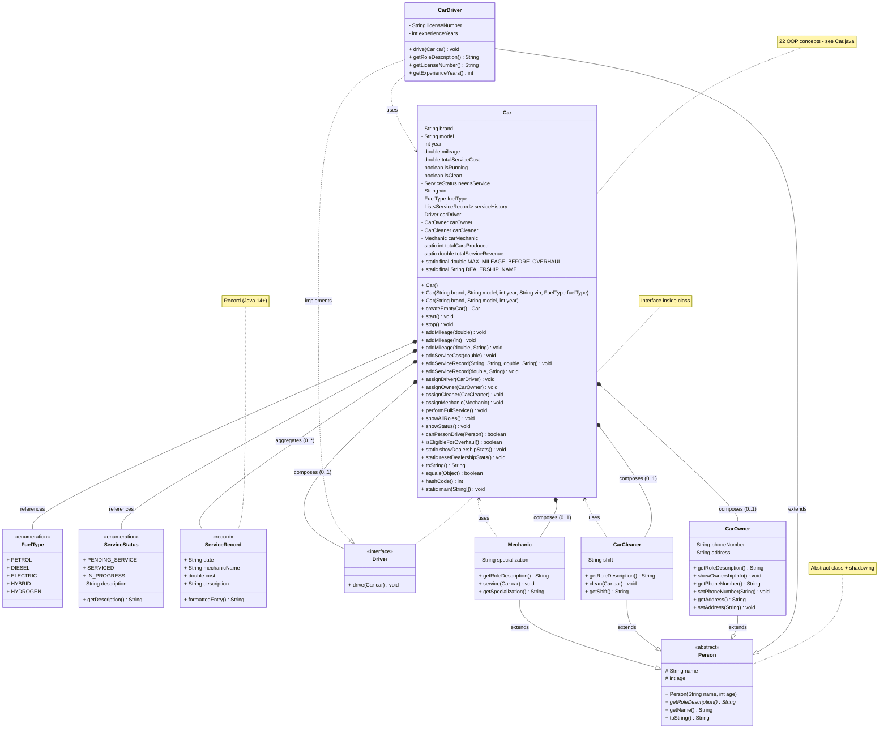
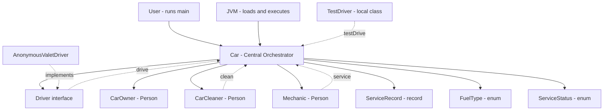
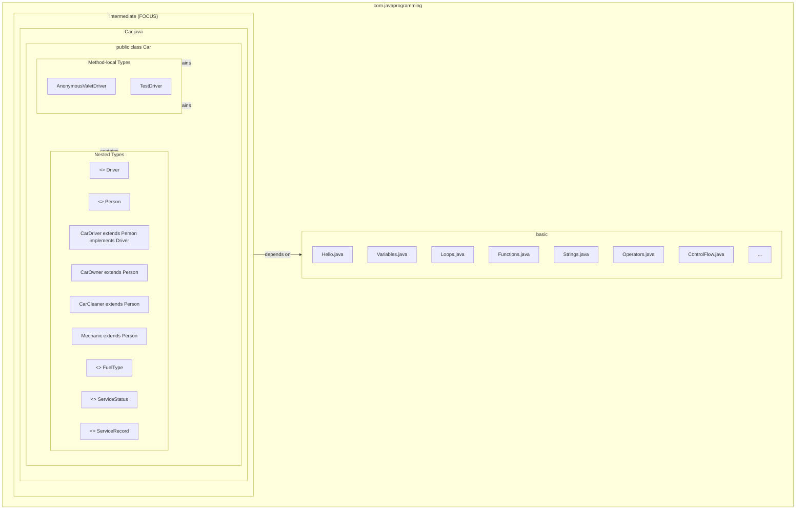
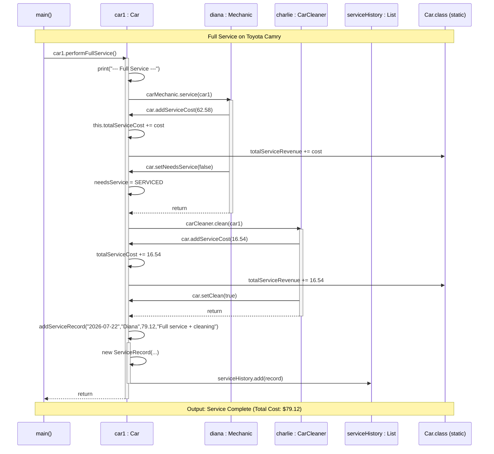
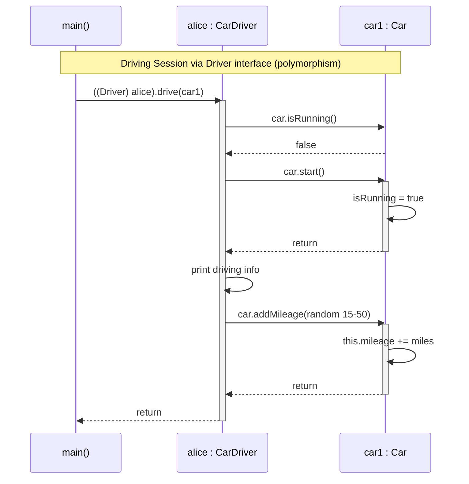
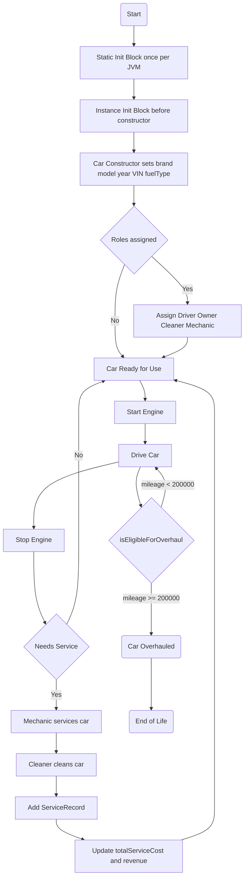
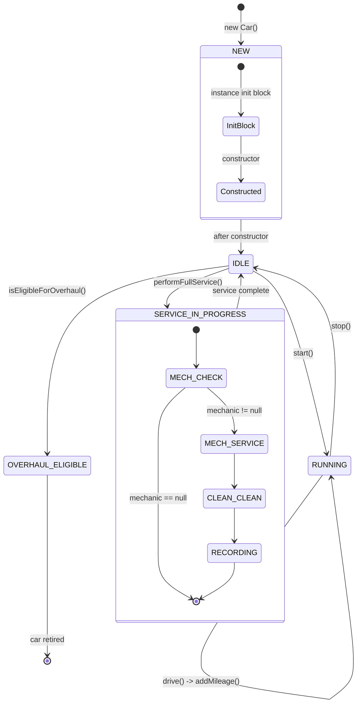
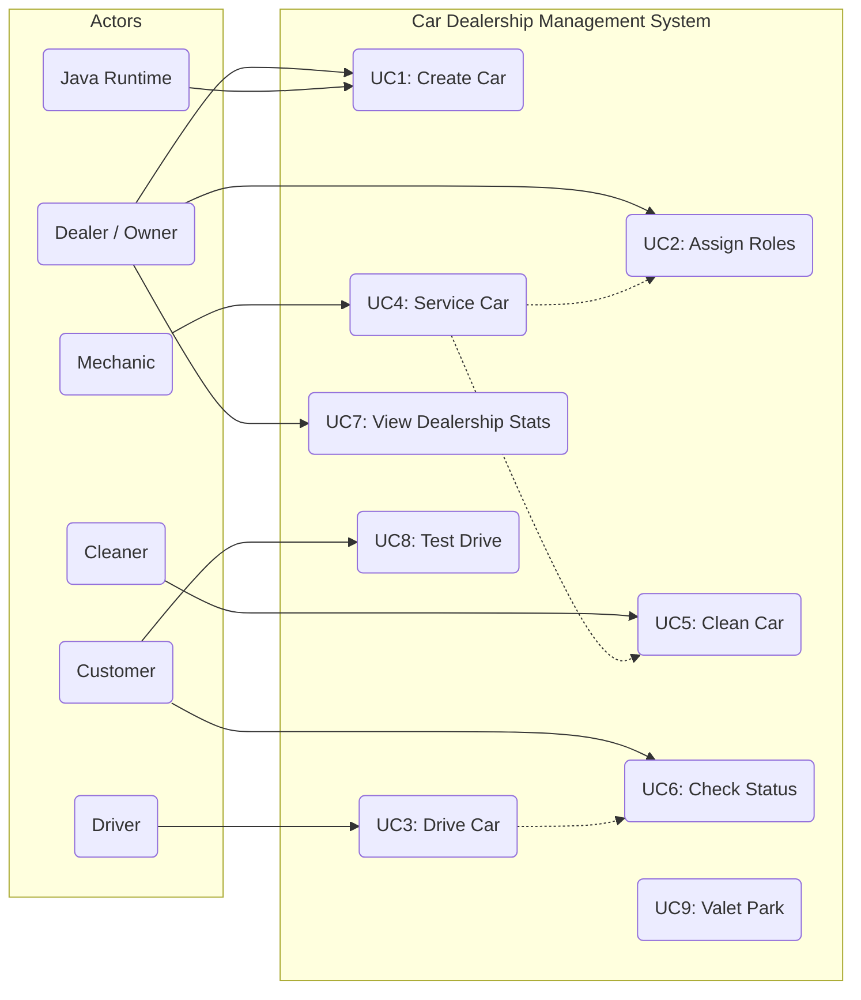

# Car Dealership Management System — Low-Level Design (LLD)

> **Author:** Java Starter Kit  
> **Domain:** Car Dealership Management  
> **Technology:** Java 21+  
> **Design Pattern:** Composition-based OOP with layered roles

---

## Table of Contents

1. [Structural Diagrams](#1-structural-diagrams)
   - [1.1 Enhanced Class Diagram](#11-enhanced-class-diagram)
   - [1.2 Object Diagram (Runtime Snapshot)](#12-object-diagram-runtime-snapshot)
   - [1.3 Component Diagram](#13-component-diagram)
   - [1.4 Package Diagram](#14-package-diagram)
2. [Behavioral Diagrams](#2-behavioral-diagrams)
   - [2.1 Sequence Diagram — Full Service Flow](#21-sequence-diagram--full-service-flow)
   - [2.2 Sequence Diagram — Driving Session](#22-sequence-diagram--driving-session)
   - [2.3 Activity Diagram — Car Lifecycle](#23-activity-diagram--car-lifecycle)
   - [2.4 State Machine Diagram — Car States](#24-state-machine-diagram--car-states)
   - [2.5 Use Case Diagram — Dealership System](#25-use-case-diagram--dealership-system)
3. [Concept-to-Diagram Mapping](#3-concept-to-diagram-mapping)

---

## 1. Structural Diagrams

### 1.1 Enhanced Class Diagram

> **Purpose:** Shows the static structure of all classes, interfaces, enums, records, their attributes, methods, and inter-relationships.

---

### 1.2 Object Diagram (Runtime Snapshot)

> **Purpose:** Captures a snapshot of instantiated objects and their specific values at a point in time during `main()`, showing relationships between Car instances and their assigned roles.

```mermaid
classDiagram
    class car1 {
        brand = "Toyota"
        model = "Camry"
        year = 2024
        vin = "VIN-TO-2024"
        fuelType = PETROL
        mileage = 202.5
        totalServiceCost = 79.12
        isRunning = true
        isClean = true
        needsService = SERVICED
    }

    class alice {
        name = "Alice Johnson"
        age = 32
        licenseNumber = "LIC-A123"
        experienceYears = 10
    }

    class bob {
        name = "Bob Johnson"
        age = 35
        phoneNumber = "555-0101"
        address = "123 Main St, Springfield"
    }

    class charlie {
        name = "Charlie"
        age = 28
        shift = "Morning"
    }

    class diana {
        name = "Diana"
        age = 45
        specialization = "Engine"
    }

    class sr1 {
        date = "2026-07-22"
        mechanicName = "Diana"
        cost = 79.12
        description = "Full service + cleaning"
    }

    class car2 {
        brand = "Tesla"
        model = "Model 3"
        year = 2025
        vin = "VIN-TSLA-2025-001"
        fuelType = ELECTRIC
        mileage = 41.3
        totalServiceCost = 199.83
        isRunning = false
        isClean = true
        needsService = SERVICED
    }

    class eve {
        name = "Eve Smith"
        age = 29
        licenseNumber = "LIC-B456"
        experienceYears = 5
    }

    class frank {
        name = "Frank Smith"
        age = 33
        phoneNumber = "555-0202"
        address = "456 Oak Ave, Metropolis"
    }

    class grace {
        name = "Grace"
        age = 31
        shift = "Evening"
    }

    class henry {
        name = "Henry"
        age = 50
        specialization = "Electrical"
    }

    class sr2 {
        date = "2026-07-22"
        mechanicName = "Henry"
        cost = 199.83
        description = "Full service + cleaning"
    }

    class car3 {
        brand = "Ford"
        model = "Mustang"
        year = 2023
        vin = "VIN-FORD-2023-001"
        fuelType = PETROL
        mileage = 49.9
        totalServiceCost = 266.91
        isRunning = true
        isClean = true
        needsService = SERVICED
    }

    class isaac {
        name = "Isaac Newton"
        age = 40
        licenseNumber = "LIC-C789"
        experienceYears = 15
    }

    class judy {
        name = "Judy Newton"
        age = 38
        phoneNumber = "555-0303"
        address = "789 Pine Rd, Gotham"
    }

    class kevin {
        name = "Kevin"
        age = 25
        shift = "Morning"
    }

    class linda {
        name = "Linda"
        age = 42
        specialization = "Brakes"
    }

    class sr3 {
        date = "2026-07-22"
        mechanicName = "Linda"
        cost = 266.91
        description = "Full service + cleaning"
    }

    class CarClass {
        totalCarsProduced = 3
        totalServiceRevenue = 545.86
        MAX_MILEAGE_BEFORE_OVERHAUL = 200000.0
        DEALERSHIP_NAME = "Premium Auto Dealers"
    }

    car1 --> alice : carDriver
    car1 --> bob : carOwner
    car1 --> charlie : carCleaner
    car1 --> diana : carMechanic
    car1 --> sr1 : serviceHistory[0]

    car2 --> eve : carDriver
    car2 --> frank : carOwner
    car2 --> grace : carCleaner
    car2 --> henry : carMechanic
    car2 --> sr2 : serviceHistory[0]

    car3 --> isaac : carDriver
    car3 --> judy : carOwner
    car3 --> kevin : carCleaner
    car3 --> linda : carMechanic
    car3 --> sr3 : serviceHistory[0]
```

---

### 1.3 Component Diagram

> **Purpose:** Shows high-level software components, their interfaces, and dependencies. The Car class acts as a central orchestrator composing role components.

---

### 1.4 Package Diagram

> **Purpose:** Shows the logical organization of the codebase into packages and how the Car class and its nested types map to the Java package structure.

---

## 2. Behavioral Diagrams

### 2.1 Sequence Diagram — Full Service Flow

> **Purpose:** Shows the timeline of method calls when `car1.performFullService()` is invoked.

---

### 2.2 Sequence Diagram — Driving Session

> **Purpose:** Shows the timeline when a CarDriver drives a Car via the Driver interface (polymorphism).

---

### 2.3 Activity Diagram — Car Lifecycle

> **Purpose:** Maps the complete workflow of a Car's lifecycle from creation to potential overhaul.

---

### 2.4 State Machine Diagram — Car States

> **Purpose:** Represents the various states a Car object can be in and the transitions triggered by method calls.

---

### 2.5 Use Case Diagram — Dealership System

> **Purpose:** Defines functional requirements from the perspective of different actors interacting with the Car system.

---

## 3. Concept-to-Diagram Mapping

This table maps each of the 22 OOP concepts to the specific diagrams where they are visually represented:

| # | Concept | Class | Object | Component | Package | Sequence | Activity | State Machine | Use Case |
|---|---------|:---:|:---:|:---:|:---:|:---:|:---:|:---:|:---:|
| 1 | **Class** | ✅ | ✅ | ✅ | ✅ | ✅ | ✅ | ✅ | ✅ |
| 2i | **Default Constructor** | ✅ |  |  |  |  | ✅ | ✅ |  |
| 2ii | **No-Arg Constructor** | ✅ |  |  |  |  |  |  |  |
| 2iii | **Parameterized Constructor** | ✅ | ✅ |  |  |  | ✅ | ✅ |  |
| 2iv | **Constructor Overloading** | ✅ |  |  |  |  |  |  |  |
| 2v | **Constructor Chaining** |  |  |  |  |  | ✅ | ✅ |  |
| 3i | **Instance variables** | ✅ | ✅ |  |  |  |  | ✅ |  |
| 3ii | **Static variables** | ✅ | ✅ |  |  | ✅ | ✅ |  |  |
| 3iii | **final variable** | ✅ | ✅ |  |  |  |  |  |  |
| 4 | **Getters & Setters** | ✅ |  |  |  |  |  |  |  |
| 5i | **Instance methods** | ✅ |  |  |  | ✅ | ✅ | ✅ | ✅ |
| 5ii | **Static methods** | ✅ | ✅ |  |  | ✅ |  |  | ✅ |
| 5iii | **Method Overloading** | ✅ |  |  |  |  |  |  |  |
| 5iv | **Method Overriding** | ✅ |  |  |  | ✅ |  |  |  |
| 5v | **final method** | ✅ |  |  |  |  | ✅ | ✅ |  |
| 6i | **Instance Init Block** |  |  |  |  |  | ✅ | ✅ |  |
| 6ii | **Static Init Block** | ✅ | ✅ |  |  | ✅ | ✅ |  |  |
| 7 | **Interface inside class** | ✅ |  | ✅ | ✅ | ✅ |  |  |  |
| 8 | **Nested class** | ✅ | ✅ | ✅ | ✅ | ✅ | ✅ |  |  |
| 9 | **Abstract class** | ✅ |  | ✅ | ✅ |  |  |  |  |
| 10 | **this keyword** |  |  |  |  |  | ✅ |  |  |
| 11 | **super keyword** | ✅ |  |  |  |  |  |  |  |
| 12 | **instanceof operator** |  |  |  |  |  | ✅ | ✅ |  |
| 13 | **Encapsulation** | ✅ | ✅ | ✅ |  |  |  |  |  |
| 14 | **Polymorphism** | ✅ |  | ✅ |  | ✅ |  |  |  |
| 15 | **Composition** | ✅ | ✅ | ✅ |  |  | ✅ |  |  |
| 16 | **Anonymous class** |  |  | ✅ | ✅ |  |  |  |  |
| 17 | **Local class** |  |  | ✅ | ✅ |  |  |  |  |
| 18 | **Variable shadowing** |  |  |  |  |  |  |  |  |
| 19 | **var keyword** |  |  |  |  |  |  |  |  |
| 20 | **Record** | ✅ | ✅ | ✅ | ✅ | ✅ |  |  |  |
| 21 | **Enum** | ✅ | ✅ | ✅ | ✅ |  |  | ✅ |  |
| 22 | **Object overrides** | ✅ |  |  |  |  |  |  |  |

---

## Files Summary

| File | Size | Contents |
|------|------|----------|
| `Car.java` | 858 lines | Full implementation with 22 OOP concepts |
| `CarLowLevelDesign.md` | ~700 lines | 9 UML diagrams (this file) |

> **To render diagrams:** Open this file with VS Code's built-in Markdown preview, or use a Mermaid extension. All diagrams use standard Mermaid syntax compatible with GitHub, GitLab, and most markdown renderers.