# Car Dealership Management System — Low-Level Design (LLD)

> **Author:** Java Starter Kit  
> **Domain:** Car Dealership Management  
> **Technology:** Java 21+  
> **Design Pattern:** Composition-based OOP with layered roles

---

## Table of Contents

1. [Structural Diagrams](#1-structural-diagrams)
   - [1.1 Enhanced Class Diagram](#11-enhanced-class-diagram)
   - [1.2 Object Diagram (Runtime Snapshot)](#12-object-diagram-runtime-snapshot)
   - [1.3 Component Diagram](#13-component-diagram)
   - [1.4 Package Diagram](#14-package-diagram)
2. [Behavioral Diagrams](#2-behavioral-diagrams)
   - [2.1 Sequence Diagram — Full Service Flow](#21-sequence-diagram--full-service-flow)
   - [2.2 Sequence Diagram — Driving Session](#22-sequence-diagram--driving-session)
   - [2.3 Activity Diagram — Car Lifecycle](#23-activity-diagram--car-lifecycle)
   - [2.4 State Machine Diagram — Car States](#24-state-machine-diagram--car-states)
   - [2.5 Use Case Diagram — Dealership System](#25-use-case-diagram--dealership-system)
3. [Concept-to-Diagram Mapping](#3-concept-to-diagram-mapping)

---

## 1. Structural Diagrams

### 1.1 Enhanced Class Diagram

> **Purpose:** Shows the static structure of all classes, interfaces, enums, records, their attributes, methods, and inter-relationships.

```mermaid
---
title: Fig 1.1 — Enhanced UML Class Diagram
---
classDiagram

    %% ==========================================================
    %% ENUMS
    %% ==========================================================
    class FuelType {
        <<enumeration>>
        + PETROL
        + DIESEL
        + ELECTRIC
        + HYBRID
        + HYDROGEN
        +valueOf(String) FuelType
        +values() FuelType[]
    }

    class ServiceStatus {
        <<enumeration>>
        + PENDING_SERVICE
        + SERVICED
        + IN_PROGRESS
        - String description
        + ServiceStatus(String description)
        + getDescription() String
    }

    %% ==========================================================
    %% RECORD
    %% ==========================================================
    class ServiceRecord {
        <<record>>
        + String date
        + String mechanicName
        + double cost
        + String description
        + ServiceRecord(String date, String mechanicName, double cost, String description)
        + formattedEntry() String
    }

    %% ==========================================================
    %% INTERFACE
    %% ==========================================================
    class Driver {
        <<interface>>
        + drive(Car car) void*
    }

    %% ==========================================================
    %% ABSTRACT CLASS
    %% ==========================================================
    class Person {
        <<abstract>>
        # String name
        # int age
        + Person(String name, int age)
        + getRoleDescription()* String
        + getName() String
        + toString() String
    }

    %% ==========================================================
    %% CONCRETE NESTED CLASSES
    %% ==========================================================
    class CarDriver {
        - final String licenseNumber
        - int experienceYears
        + CarDriver(String name, int age, String licenseNumber, int experienceYears)
        + drive(Car car) void
        + getRoleDescription() String
        + getLicenseNumber() String
        + getExperienceYears() int
    }

    class CarOwner {
        - String phoneNumber
        - String address
        + CarOwner(String name, int age, String phoneNumber, String address)
        + getRoleDescription() String
        + showOwnershipInfo() void
        + getPhoneNumber() String
        + setPhoneNumber(String) void
        + getAddress() String
        + setAddress(String) void
    }

    class CarCleaner {
        - String shift
        + CarCleaner(String name, int age, String shift)
        + getRoleDescription() String
        + clean(Car car) void
        + getShift() String
    }

    class Mechanic {
        - String specialization
        + Mechanic(String name, int age, String specialization)
        + getRoleDescription() String
        + service(Car car) void
        + getSpecialization() String
    }

    %% ==========================================================
    %% ANONYMOUS CLASS (conceptual)
    %% ==========================================================
    class AnonymousValetDriver {
        <<anonymous>>
        + drive(Car car) void
    }
    AnonymousValetDriver ..|> Driver : implements

    %% ==========================================================
    %% LOCAL CLASS (conceptual)
    %% ==========================================================
    class TestDriver {
        <<local>>
        - final String name
        + TestDriver(String name)
        + testDrive(Car car) void
    }

    %% ==========================================================
    %% MAIN CAR CLASS
    %% ==========================================================
    class Car {
        <<main>>
        - String brand
        - String model
        - int year
        - double mileage
        - double totalServiceCost
        - boolean isRunning
        - boolean isClean
        - ServiceStatus needsService
        - final String vin
        - FuelType fuelType
        - ArrayList~ServiceRecord~ serviceHistory
        - Driver carDriver
        - CarOwner carOwner
        - CarCleaner carCleaner
        - Mechanic carMechanic

        - static int totalCarsProduced
        - static double totalServiceRevenue
        + static final double MAX_MILEAGE_BEFORE_OVERHAUL
        + static final String DEALERSHIP_NAME

        <<constructor>>
        + Car()
        + Car(String brand, String model, int year, String vin, FuelType fuelType)
        + Car(String brand, String model, int year)
        + static createEmptyCar() Car

        <<getter/setter>>
        + getBrand() String
        + setBrand(String) void
        + getModel() String
        + setModel(String) void
        + getYear() int
        + setYear(int) void
        + getMileage() double
        + getTotalServiceCost() double
        + isClean() boolean
        + setClean(boolean) void
        + getNeedsService() ServiceStatus
        + setNeedsService(boolean) void
        + isRunning() boolean
        + getVin() String
        + getFuelType() FuelType
        + setFuelType(FuelType) void
        + getServiceHistory() List~ServiceRecord~

        <<instance methods>>
        + start() void
        + stop() void
        + addMileage(double) void
        + addMileage(int) void
        + addMileage(double, String) void
        + addServiceCost(double) void
        + addServiceRecord(String, String, double, String) void
        + addServiceRecord(double, String) void
        + assignDriver(CarDriver) void
        + assignOwner(CarOwner) void
        + assignCleaner(CarCleaner) void
        + assignMechanic(Mechanic) void
        + performFullService() void
        + showAllRoles() void
        + showStatus() void
        + canPersonDrive(Person) boolean
        + final isEligibleForOverhaul() boolean

        <<static methods>>
        + static showDealershipStats() void
        + static resetDealershipStats() void

        <<object overrides>>
        + toString() String
        + equals(Object) boolean
        + hashCode() int

        <<entry point>>
        + static main(String[]) void
    }

    %% ==========================================================
    %% RELATIONSHIPS
    %% ==========================================================

    %% Inheritance Hierarchies
    CarDriver --|> Person : «extends»\nsuper(name, age)
    CarDriver ..|> Driver : «implements»\ndrive(Car)
    CarOwner --|> Person : «extends»
    CarCleaner --|> Person : «extends»
    Mechanic --|> Person : «extends»

    %% Composition (Car owns instances — strong has-a)
    Car *-- Driver : «composition»\n0..1 carDriver
    Car *-- CarOwner : «composition»\n0..1 carOwner
    Car *-- CarCleaner : «composition»\n0..1 carCleaner
    Car *-- Mechanic : «composition»\n0..1 carMechanic
    Car *-- ServiceRecord : «aggregation»\n0..* serviceHistory
    Car *-- FuelType : «enum»\n1 fuelType
    Car *-- ServiceStatus : «enum»\n1 needsService

    %% Dependency (uses relationship)
    CarDriver ..> Car : «uses»\ndrive(Car car)
    CarCleaner ..> Car : «uses»\nclean(Car car)
    Mechanic ..> Car : «uses»\nservice(Car car)
    Car ..> Person : «uses»\ncanPersonDrive(Person)
    TestDriver ..> Car : «uses»\ntestDrive(Car car)

    %% Notes for key concepts
    note for Car "CONCEPT INDEX\n━━━━━━━━━━━━━\n★ Class\n★ Constructor Overloading\n★ Constructor Chaining\n★ Instance/Static Init Block\n★ final method / constant\n★ Method Overloading\n★ Encapsulation\n★ Composition\n★ this/super/instanceof"
    note for Person "CONCEPT INDEX\n━━━━━━━━━━━━━\n★ Abstract class\n★ Variable shadowing\n★ super keyword\n★ Method overriding"
    note for Driver "★ Interface inside class\n★ Polymorphism"
    note for ServiceRecord "★ Record (Java 14+)\n★ Compact constructor\n★ Immutability"
    note for FuelType "★ Enum (simple)"
    note for ServiceStatus "★ Enum with fields\n★ Constructor + methods"
    note for CarDriver "★ Nested class\n★ Multiple inheritance\n  (extends Person +\n   implements Driver)\n★ final field"
    note for AnonymousValetDriver "★ Anonymous class\n  (defined in main())"
    note for TestDriver "★ Local class\n  (defined inside method)"
```



---

### 1.2 Object Diagram (Runtime Snapshot)

> **Purpose:** Captures a snapshot of instantiated objects and their specific values at a point in time during the `main()` method execution — showing the relationships between the `Car` instances and their assigned roles.

```mermaid
---
title: Fig 1.2 — Object Diagram (Runtime Snapshot after Service)
---
objectDiagram

    %% ─── Car #1: Toyota Camry ───────────────────────
    object "car1 : Car" as car1 {
        brand = "Toyota"
        model = "Camry"
        year = 2024
        vin = "VIN-TO-2024"
        fuelType = PETROL
        mileage = 202.5
        totalServiceCost = 79.12
        isRunning = true
        isClean = true
        needsService = SERVICED
    }

    object "alice : CarDriver" as alice {
        name = "Alice Johnson"
        age = 32
        licenseNumber = "LIC-A123"
        experienceYears = 10
    }

    object "bob : CarOwner" as bob {
        name = "Bob Johnson"
        age = 35
        phoneNumber = "555-0101"
        address = "123 Main St, Springfield"
    }

    object "charlie : CarCleaner" as charlie {
        name = "Charlie"
        age = 28
        shift = "Morning"
    }

    object "diana : Mechanic" as diana {
        name = "Diana"
        age = 45
        specialization = "Engine"
    }

    object ": ServiceRecord" as sr1 {
        date = "2026-07-22"
        mechanicName = "Diana"
        cost = 79.12
        description = "Full service + cleaning"
    }

    %% ─── Car #2: Tesla Model 3 ─────────────────────
    object "car2 : Car" as car2 {
        brand = "Tesla"
        model = "Model 3"
        year = 2025
        vin = "VIN-TSLA-2025-001"
        fuelType = ELECTRIC
        mileage = 41.3
        totalServiceCost = 199.83
        isRunning = false
        isClean = true
        needsService = SERVICED
    }

    object "eve : CarDriver" as eve {
        name = "Eve Smith"
        age = 29
        licenseNumber = "LIC-B456"
        experienceYears = 5
    }

    object "frank : CarOwner" as frank {
        name = "Frank Smith"
        age = 33
        phoneNumber = "555-0202"
        address = "456 Oak Ave, Metropolis"
    }

    object "grace : CarCleaner" as grace {
        name = "Grace"
        age = 31
        shift = "Evening"
    }

    object "henry : Mechanic" as henry {
        name = "Henry"
        age = 50
        specialization = "Electrical"
    }

    object ": ServiceRecord" as sr2 {
        date = "2026-07-22"
        mechanicName = "Henry"
        cost = 199.83
        description = "Full service + cleaning"
    }

    %% ─── Car #3: Ford Mustang ───────────────────────
    object "car3 : Car" as car3 {
        brand = "Ford"
        model = "Mustang"
        year = 2023
        vin = "VIN-FORD-2023-001"
        fuelType = PETROL
        mileage = 49.9
        totalServiceCost = 266.91
        isRunning = true
        isClean = true
        needsService = SERVICED
    }

    object "isaac : CarDriver" as isaac {
        name = "Isaac Newton"
        age = 40
        licenseNumber = "LIC-C789"
        experienceYears = 15
    }

    object "judy : CarOwner" as judy {
        name = "Judy Newton"
        age = 38
        phoneNumber = "555-0303"
        address = "789 Pine Rd, Gotham"
    }

    object "kevin : CarCleaner" as kevin {
        name = "Kevin"
        age = 25
        shift = "Morning"
    }

    object "linda : Mechanic" as linda {
        name = "Linda"
        age = 42
        specialization = "Brakes"
    }

    object ": ServiceRecord" as sr3 {
        date = "2026-07-22"
        mechanicName = "Linda"
        cost = 266.91
        description = "Full service + cleaning"
    }

    %% ─── Links (object relationships) ────────────────
    car1 --> alice   : carDriver
    car1 --> bob     : carOwner
    car1 --> charlie : carCleaner
    car1 --> diana   : carMechanic
    car1 --> sr1     : serviceHistory[0]

    car2 --> eve     : carDriver
    car2 --> frank   : carOwner
    car2 --> grace   : carCleaner
    car2 --> henry   : carMechanic
    car2 --> sr2     : serviceHistory[0]

    car3 --> isaac   : carDriver
    car3 --> judy    : carOwner
    car3 --> kevin   : carCleaner
    car3 --> linda   : carMechanic
    car3 --> sr3     : serviceHistory[0]

    %% ─── Static context (class-level) ────────────────
    object "Car (class)" as carClass {
        <<static>>
        totalCarsProduced = 3
        totalServiceRevenue = 545.86
        MAX_MILEAGE_BEFORE_OVERHAUL = 200000.0
        DEALERSHIP_NAME = "Premium Auto Dealers"
    }
```

---

### 1.3 Component Diagram

> **Purpose:** Shows the high-level software components, their interfaces, and dependencies. This illustrates how the `Car` class acts as a central orchestrator that composes role components.

```mermaid
---
title: Fig 1.3 — Component Diagram
---
block-beta
    columns 3

    %% ─── Row 1: External Actors ──────────────────────
    block:external
        columns 1
        User("👤 User")
        System("💻 JVM")
    end

    space:1

    block:diagrams
        columns 1
        title("📊 Diagrams")
        ClassD("Class Diagram")
        ObjectD("Object Diagram")
        SequenceD("Sequence Diagram")
        StateD("State Machine")
    end

    %% ─── Row 2: Core Component ──────────────────────
    space

    block:core
        columns 1
        title("🔷 CarComponent")
        C("Car")
        style C fill:#4a90d9,color:#fff
    end

    space

    %% ─── Row 3: Sub-components ──────────────────────
    block:roles
        columns 2
        title("👤 Role Components (Composition)")
        D("Driver\n<<interface>>")
        O("CarOwner\n<<Person>>")
        CL("CarCleaner\n<<Person>>")
        M("Mechanic\n<<Person>>")
    end

    block:data
        columns 1
        title("📦 Data Components")
        SR("ServiceRecord\n<<record>>")
        FT("FuelType\n<<enum>>")
        SS("ServiceStatus\n<<enum>>")
    end

    %% ─── Row 4: Adapters ────────────────────────────
    block:adapters
        columns 2
        title("⚡ Adapters")
        Anon("AnonymousValetDriver\n<<anonymous>>")
        Local("TestDriver\n<<local>>")
    end

    space:1

    %% ─── Connections ─────────────────────────────────
    User --> C : "runs main()"
    System --> C : "loads & executes"

    C --> D : "composes"
    C --> O : "composes"
    C --> CL : "composes"
    C --> M : "composes"
    C --> SR : "aggregates (serviceHistory)"
    C --> FT : "references (fuelType)"
    C --> SS : "references (needsService)"

    D ..> C : "uses (drive(Car))"
    CL ..> C : "uses (clean(Car))"
    M ..> C : "uses (service(Car))"

    Anon ..|> D : "implements"
    Local ..> C : "uses (testDrive(Car))"
```

---

### 1.4 Package Diagram

> **Purpose:** Shows the logical organization of the codebase into packages and how the `Car` class and its nested types map to the Java package structure.

```mermaid
---
title: Fig 1.4 — Package Diagram
---
block-beta
    columns 1

    block:root
        columns 1
        title("📁 com.javaprogramming")
        style root fill:#2d3748,color:#fff

        block:basic
            columns 3
            title("📁 basic")
            A("Hello.java")
            B("Variables.java")
            C("Loops.java")
            D("Functions.java")
            E("Strings.java")
            F("Operators.java")
            G("DateTimes.java")
            H("RegexDemo.java")
            I("ArraysDemo.java")
            J("MapsDemo.java")
            K("SetsDemo.java")
            L("ControlFlow.java")
        end

        block:intermediate
            columns 1
            title("📁 intermediate (FOCUS)")

            block:car_pkg
                columns 1
                title("🚗 Car.java")

                block:car_class
                    columns 1
                    title("public class Car")
                    style car_class fill:#4a90d9,color:#fff

                    block:nested
                        columns 2
                        title("Nested Types")
                        I_("<<interface>> Driver")
                        A_("<<abstract>> Person")
                        CD("CarDriver extends Person\nimplements Driver")
                        CO("CarOwner extends Person")
                        CC("CarCleaner extends Person")
                        M_("Mechanic extends Person")
                        E1("<<enum>> FuelType")
                        E2("<<enum>> ServiceStatus")
                        R_("<<record>> ServiceRecord")
                    end

                    block:anon_local
                        columns 2
                        title("Method-local Types")
                        AN("AnonymousValetDriver\n(inside main)")
                        LT("TestDriver\n(inside main)")
                    end
                end
            end

            block:other
                columns 2
                X("Other intermediate files ...")
            end
        end
    end

    note left of car_class "Fully Qualified:\ncom.javaprogramming.intermediate.Car"

    intermediate --> basic : "depends on\n(educational hierarchy)"
    car_pkg --> car_class : "contains"
    car_class --> nested : "contains (inner)"
    car_class --> anon_local : "contains (method-local)"
```

---

## 2. Behavioral Diagrams

### 2.1 Sequence Diagram — Full Service Flow

> **Purpose:** Shows the timeline of method calls and interactions when `car1.performFullService()` is invoked.

```mermaid
---
title: Fig 2.1 — Sequence Diagram: Full Service Flow
---
sequenceDiagram
    participant Client as "main()"
    participant Car1 as "car1 : Car"
    participant Mech as "diana : Mechanic"
    participant Clean as "charlie : CarCleaner"
    participant History as "serviceHistory\n:List<ServiceRecord>"
    participant Static as "Car.class\n(static context)"

    Note over Client,Static: PERFORM FULL SERVICE on Toyota Camry
    Client ->> Car1: car1.performFullService()
    activate Car1

    Car1 ->> Car1: print("--- Full Service for Toyota Camry ---")

    %% Mechanic service step
    Car1 ->> Mech: carMechanic.service(car1)
    activate Mech
    Mech ->> Car1: car.addServiceCost(62.58)
    Car1 ->> Car1: this.totalServiceCost += cost
    Car1 ->> Static: totalServiceRevenue += cost
    Mech ->> Car1: car.setNeedsService(false)
    Car1 ->> Car1: needsService = SERVICED
    Mech -->> Car1: return
    deactivate Mech

    %% Cleaner step
    Car1 ->> Clean: carCleaner.clean(car1)
    activate Clean
    Clean ->> Car1: car.addServiceCost(16.54)
    Car1 ->> Car1: totalServiceCost += cost
    Car1 ->> Static: totalServiceRevenue += cost
    Clean ->> Car1: car.setClean(true)
    Car1 ->> Car1: isClean = true
    Clean -->> Car1: return
    deactivate Clean

    %% Record creation
    Car1 ->> Car1: addServiceRecord("2026-07-22", "Diana", 79.12, "Full service + cleaning")
    activate Car1
    Car1 ->> Car1: new ServiceRecord(...)
    Note over Car1: Compact constructor validates cost >= 0
    Car1 ->> History: serviceHistory.add(record)
    deactivate Car1

    Car1 -->> Client: return
    deactivate Car1

    Note over Client,Static: Output: Service Complete (Total Cost: $79.12)
```

---

### 2.2 Sequence Diagram — Driving Session

> **Purpose:** Shows the timeline of interactions when a `CarDriver` drives a `Car`. This illustrates polymorphism through the `Driver` interface.

```mermaid
---
title: Fig 2.2 — Sequence Diagram: Driving Session
---
sequenceDiagram
    participant Client as "main()"
    participant Car1 as "car1 : Car"
    participant Driver as "alice : CarDriver\n(implements Driver)"
    participant Engine as "car1.isRunning"

    Note over Client,Engine: DRIVING SESSION via Driver interface

    %% Polymorphic call
    Client ->> Driver: ((Driver) alice).drive(car1)
    activate Driver
    Note over Driver: Polymorphism:\ncalled via Driver interface

    %% Check engine
    Driver ->> Car1: car.isRunning()
    Car1 ->> Engine: return false
    Engine -->> Driver: false

    %% Start engine
    Driver ->> Car1: car.start()
    activate Car1
    Car1 ->> Car1: isRunning = true
    Car1 -->> Driver: return
    deactivate Car1

    %% Drive & add mileage
    Driver ->> Driver: print driving info
    Driver ->> Car1: car.addMileage(random 15-50)
    activate Car1
    Car1 ->> Car1: this.mileage += miles
    Car1 -->> Driver: return
    deactivate Car1

    Driver -->> Client: return
    deactivate Driver

    Note over Client,Engine: Afterwards: Client calls car1.showStatus()
```

---

### 2.3 Activity Diagram — Car Lifecycle

> **Purpose:** Maps the complete workflow/logic flow of a Car's lifecycle from creation to end-of-life, showing decision points and parallel activities.

```mermaid
---
title: Fig 2.3 — Activity Diagram: Car Lifecycle
---
stateDiagram-v2
    state "⛶ Car Lifecycle" as main {
        [*] --> Initialize

        state "Static Init Block" as staticInit
        state "Instance Init Block" as instanceInit
        state "Car Constructed" as created

        state fork_create <<fork>>
        state join_ready <<join>>

        state "Assign Roles\n(Driver, Owner, Cleaner, Mechanic)" as assignRoles
        state "Car Ready for Use" as ready

        %% ─── Driving Path ──────────────────────────
        state "Start Engine" as startEngine
        state "Drive Car\naddMileage()" as drive
        state "Stop Engine" as stopEngine

        %% ─── Service Path ──────────────────────────
        state "Needs Service?\n(needsService flag)" as needsServiceCheck
        state "Mechanic services car\nservice(this)" as mechanicService
        state "Cleaner cleans car\nclean(this)" as cleanerClean
        state "Add ServiceRecord\n(addServiceRecord)" as addRecord
        state "Update totalServiceCost" as updateCost

        %% ─── Overhaul Check ────────────────────────
        state "Check Overhaul\nisEligibleForOverhaul()" as overhaulCheck
        state "Car Overhauled" as overhauled

        %% ─── Flow ──────────────────────────────────
        [*] --> staticInit : class loads
        staticInit --> instanceInit : new Car()
        instanceInit --> created : constructor runs

        created --> fork_create
        fork_create --> assignRoles
        fork_create --> ready : (roles optional)
        assignRoles --> ready

        ready --> startEngine : "start()"
        startEngine --> drive
        drive --> stopEngine
        stopEngine --> needsServiceCheck

        needsServiceCheck --> mechanicService : [needsService == true]
        needsServiceCheck --> ready : [needsService == false]

        mechanicService --> cleanerClean
        cleanerClean --> addRecord
        addRecord --> updateCost
        updateCost --> ready

        drive --> overhaulCheck : "periodic check"
        overhaulCheck --> [*] : [mileage >= 200,000]
        overhaulCheck --> ready : [mileage < 200,000]
    }

    note right of staticInit "Runs once per JVM session"
    note right of instanceInit "Runs before every constructor"
    note right of fork_create "Composition: roles not mandatory"
    note right of overhaulCheck "final method isEligibleForOverhaul()"
```

---

### 2.4 State Machine Diagram — Car States

> **Purpose:** Represents the various states a `Car` object can be in and the transitions triggered by method calls.

```mermaid
---
title: Fig 2.4 — State Machine Diagram: Car Object States
---
stateDiagram-v2

    %% ─── Initial State ──────────────────────────────
    state "NEW\n(mileage=5, clean=false,\nneedsService=PENDING)" as newState

    %% ─── Core States ───────────────────────────────
    state "IDLE\n(engine=off, clean=✓\nor ✗, needsService?\nmay vary)" as idle
    state "RUNNING\n(engine=on, actively\ndrivable)" as running
    state "SERVICING\n(mechanic working)" as servicing
    state "CLEANING\n(cleaner working)" as cleaning

    %% ─── Composite State ───────────────────────────
    state "SERVICE_IN_PROGRESS" as serviceFlow {
        state "MECHANIC_CHECKING" as mechCheck
        state "MECHANIC_SERVICING" as mechWork
        state "CLEANER_CLEANING" as cleanWork
        state "RECORDING_SERVICE" as recordWork

        [*] --> mechCheck
        mechCheck --> mechWork : mechanic != null
        mechCheck --> [*] : mechanic == null
        mechWork --> cleanWork
        cleanWork --> recordWork
        recordWork --> [*]
    }

    state "OVERHAUL_ELIGIBLE\n(mileage >= 200,000)" as overhaul

    %% ─── Transitions ───────────────────────────────
    [*] --> newState : new Car()
    newState --> idle : after constructor

    %% Idle ↔ Running
    idle --> running : start()
    running --> idle : stop()

    %% Drive (while running)
    running --> running : drive() → addMileage()

    %% Service entry
    idle --> serviceFlow : performFullService()

    %% Return from service
    serviceFlow --> idle : service complete →\nneedsService=SERVICED\nclean=true

    %% Overhaul eligibility
    idle --> overhaul : isEligibleForOverhaul() == true\n(mileage threshold crossed)
    overhaul --> idle : after overhaul

    %% Terminal
    overhaul --> [*] : retired

    %% ─── Notes ─────────────────────────────────────
    note right of newState "Init block sets defaults\nConstructor overrides"
    note right of running "isRunning == true"
    note left of overhaul "final method — cannot override"
```

---

### 2.5 Use Case Diagram — Dealership System

> **Purpose:** Defines the functional requirements from the perspective of different actors (users/roles) interacting with the Car system.

```mermaid
---
title: Fig 2.5 — Use Case Diagram: Dealership System
---
flowchart LR
    %% ACTORS
    Actor_Dealer(["👤 Dealer/Owner"])
    Actor_Driver(["👤 Driver"])
    Actor_Mechanic(["👤 Mechanic"])
    Actor_Cleaner(["👤 Cleaner"])
    Actor_Customer(["👤 Customer"])
    Actor_System(["💻 Java Runtime"])

    %% USE CASES
    UC1("UC1: Create Car")
    UC2("UC2: Assign Roles")
    UC3("UC3: Drive Car")
    UC4("UC4: Service Car")
    UC5("UC5: Clean Car")
    UC6("UC6: Check Status")
    UC7("UC7: View Dealership Stats")
    UC8("UC8: Test Drive")
    UC9("UC9: Valet Park")

    subgraph SYSTEM_BOUNDARY["🚗 Car Dealership Management System"]
        direction TB
        UC1
        UC2
        UC3
        UC4
        UC5
        UC6
        UC7
        UC8
        UC9
    end

    %% RELATIONSHIPS
    Actor_Dealer --> UC1 : «initiates»
    Actor_Dealer --> UC2 : «assigns»
    Actor_Dealer --> UC7 : «views»

    Actor_Driver --> UC3 : «drives»

    Actor_Mechanic --> UC4 : «performs»

    Actor_Cleaner --> UC5 : «performs»

    Actor_Customer --> UC6 : «inquires»
    Actor_Customer --> UC8 : «test drives»

    %% Include / Extend
    UC3 -.-> UC6 : «includes»
    UC4 -.-> UC5 : «includes» (cleaning after service)
    UC4 -.-> UC2 : «extends» (if no mechanic assigned)

    %% System actor
    Actor_System --> UC1 : «executes init blocks»

    %% Notes
    note["<<extends>> = optional flow\n<<includes>> = mandatory sub-flow"]
```

---

## 3. Concept-to-Diagram Mapping

This table maps each of the 22 OOP concepts to the specific diagrams where they are visually represented:

| # | Concept | Class Diagram | Object Diagram | Component Diagram | Package Diagram | Sequence Diagram | Activity Diagram | State Machine | Use Case |
|---|---------|:---:|:---:|:---:|:---:|:---:|:---:|:---:|:---:|
| 1 | **Class** | ✅ | ✅ | ✅ | ✅ | ✅ | ✅ | ✅ | ✅ |
| 2i | **Default Constructor** | ✅ |  |  |  |  |  | ✅ |  |
| 2ii | **No-Arg Constructor** | ✅ |  |  |  |  |  |  |  |
| 2iii | **Parameterized Constructor** | ✅ | ✅ |  |  | ✅ |  | ✅ |  |
| 2iv | **Constructor Overloading** | ✅ |  |  |  |  |  |  |  |
| 2v | **Constructor Chaining** | ✅ |  |  |  |  | ✅ | ✅ |  |
| 3i | **Instance variables** | ✅ | ✅ |  |  |  |  | ✅ |  |
| 3ii | **Static variables** | ✅ | ✅ |  |  | ✅ | ✅ |  |  |
| 3iii | **final variable** | ✅ | ✅ |  |  |  |  |  |  |
| 4 | **Getters & Setters** | ✅ |  |  |  |  |  |  |  |
| 5i | **Instance methods** | ✅ |  |  |  | ✅ | ✅ | ✅ | ✅ |
| 5ii | **Static methods** | ✅ | ✅ |  |  | ✅ |  |  | ✅ |
| 5iii | **Method Overloading** | ✅ |  |  |  |  |  |  |  |
| 5iv | **Method Overriding** | ✅ |  |  |  | ✅ |  |  |  |
| 5v | **final method** | ✅ |  |  |  |  | ✅ | ✅ |  |
| 6i | **Instance Init Block** | ✅ |  |  |  |  | ✅ | ✅ | ✅ |
| 6ii | **Static Init Block** | ✅ | ✅ |  |  | ✅ | ✅ | ✅ | ✅ |
| 7 | **Interface inside class** | ✅ |  | ✅ | ✅ | ✅ |  |  |  |
| 8 | **Nested class** | ✅ | ✅ | ✅ | ✅ | ✅ | ✅ |  |  |
| 9 | **Abstract class** | ✅ |  | ✅ | ✅ |  |  |  |  |
| 10 | **this keyword** |  |  |  |  |  | ✅ |  |  |
| 11 | **super keyword** | ✅ |  |  |  |  |  |  |  |
| 12 | **instanceof operator** |  |  |  |  |  | ✅ | ✅ |  |
| 13 | **Encapsulation** | ✅ | ✅ | ✅ |  |  |  |  |  |
| 14 | **Polymorphism** | ✅ |  | ✅ |  | ✅ |  |  |  |
| 15 | **Composition** | ✅ | ✅ | ✅ |  |  |  |  |  |
| 16 | **Anonymous class** | ✅ |  | ✅ | ✅ |  |  |  |  |
| 17 | **Local class** | ✅ |  | ✅ | ✅ |  |  |  |  |
| 18 | **Variable shadowing** |  |  |  |  |  |  |  |  |
| 19 | **var keyword** |  |  |  |  |  |  |  |  |
| 20 | **Record** | ✅ | ✅ | ✅ | ✅ | ✅ |  |  |  |
| 21 | **Enum** | ✅ | ✅ | ✅ | ✅ |  |  | ✅ |  |
| 22 | **Object overrides** | ✅ |  |  |  |  |  |  |  |

---

## Rendered Files Summary

| # | Diagram | File | Mermaid Type | Lines |
|---|---------|------|-------------|-------|
| 1.1 | Enhanced Class Diagram | `CarLowLevelDesign.md` | `classDiagram` | ~280 |
| 1.2 | Object Diagram | `CarLowLevelDesign.md` | `objectDiagram` | ~130 |
| 1.3 | Component Diagram | `CarLowLevelDesign.md` | `block-beta` | ~70 |
| 1.4 | Package Diagram | `CarLowLevelDesign.md` | `block-beta` | ~70 |
| 2.1 | Sequence Diagram — Service | `CarLowLevelDesign.md` | `sequenceDiagram` | ~60 |
| 2.2 | Sequence Diagram — Driving | `CarLowLevelDesign.md` | `sequenceDiagram` | ~45 |
| 2.3 | Activity Diagram | `CarLowLevelDesign.md` | `stateDiagram-v2` | ~60 |
| 2.4 | State Machine Diagram | `CarLowLevelDesign.md` | `stateDiagram-v2` | ~60 |
| 2.5 | Use Case Diagram | `CarLowLevelDesign.md` | `flowchart LR` | ~50 |

> **To view:** Open this markdown file in any Mermaid-compatible viewer (VS Code with "Markdown Preview Mermaid Support" extension, GitHub, or [mermaid.live](https://mermaid.live)).