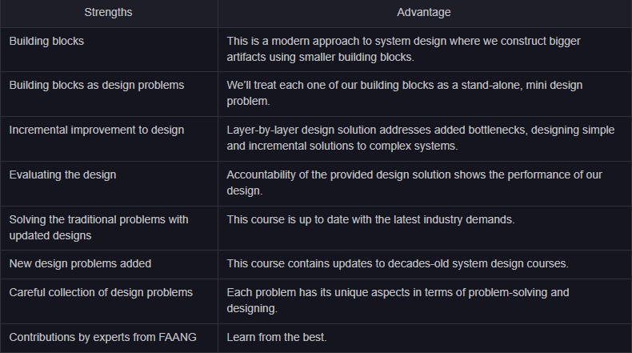

# 📐 High-Level System Design — Interactive Study Resource & Master Guide

<div align="center">

**An interactive, high-performance web platform for Grokking Modern System Design, styled after Educative.io.**




</div>

---

## 🌟 Overview & Web Application

This repository contains a complete, interactive, single-page web application for **High-Level System Design** located at [`./app/index.html`](file:///Users/avinash/Documents/development/java-starter-kit/educational-resources/system-design/high-level-design/app/index.html).

### 🚀 Key Platform Features

- **🎨 Educative-Inspired UI Layout**: Glassmorphism top navbar, dark/light mode toggle (`localStorage` persistent), global progress bar, collapsible sidebar TOC with reading times, and right-side floating in-page outline ("On this page").
- **📑 Consolidated Single-Page Master Topics**: All multi-part system design case studies (YouTube, Uber, Instagram, Twitter, Google Maps, WhatsApp, etc.) and Core Building Blocks are merged into **single unified master pages**. Read the complete end-to-end architecture on one page!
- **🖼️ 766 Architectural Diagram Images**: Full integration of all **766 architectural diagrams** (`.jpg`, `.png`, `.svg`, `.webp`) with interactive click-to-zoom full-screen lightboxes.
- **🧮 Back-of-the-Envelope Resource Estimator**: Interactive live calculator widget computing **RPS**, **Storage / Day (TB)**, **Bandwidth (Gbps)**, and **App Server Count** based on DAUs and payload inputs.
- **🔍 Instant Search (`⌘ K`)**: Modal search index across all 38 master topics and lessons.
- **✅ Progress Tracking**: Mark topics completed with real-time sidebar checkmarks (`✓`) and progress bar recalculation.

---

## 🌐 Live URLs & Access Links

- 🚀 **Live GitHub Pages Web Application**: [https://jsavinash.github.io/java-starter-kit/app/index.html](https://jsavinash.github.io/java-starter-kit/app/index.html)
- 🔗 **GitHub Pages Root Landing**: [https://jsavinash.github.io/java-starter-kit/](https://jsavinash.github.io/java-starter-kit/)
- 📦 **GitHub Repository Source Code**: [https://github.com/jsavinash/java-starter-kit/tree/dev/educational-resources/system-design/high-level-design](https://github.com/jsavinash/java-starter-kit/tree/dev/educational-resources/system-design/high-level-design)
- 🌿 **GitHub Pages Published Branch (`gh-pages`)**: [https://github.com/jsavinash/java-starter-kit/tree/gh-pages](https://github.com/jsavinash/java-starter-kit/tree/gh-pages)

---

## 💻 Quick Start & Running Locally

### Option 1: Local HTTP Web Server

Run a local HTTP web server from this directory:

```bash
# Navigate to high-level-design folder
cd educational-resources/system-design/high-level-design

# Start Python 3 HTTP Server on port 8080
python3 -m http.server 8080
```

Open your browser and navigate to:
👉 **`http://localhost:8080/app/index.html`** (or `http://localhost:8080/app/`)

### Option 2: Direct File Inspection

Simply open [`app/index.html`](file:///Users/avinash/Documents/development/java-starter-kit/educational-resources/system-design/high-level-design/app/index.html) in any modern browser (Chrome, Safari, Edge, Firefox).

---

## 📚 Course Curriculum & Modules

The platform is structured into **9 Comprehensive Modules** covering 38 consolidated master topics:

| Module | Icon | Master Topics & Description |
|:-------|:----:|:----------------------------|
| **1. Introduction to System Design** | 🧭 | What is System Design, Three Pillars, Reliability, Efficiency, Maintainability |
| **2. Non-Functional System Characteristics** | 🛡️ | Availability (Nines), Fault Tolerance, Maintainability (MTTR), Reliability, Scalability |
| **3. Core Building Blocks (16 Components)** | 🧱 | DNS, Load Balancers, Key-Value Store, CDN, Sequencer, Distributed Cache, Distributed Messaging Queue, Pub-Sub, Rate Limiter, Blob Store, Distributed Search, Distributed Logging, Task Scheduler, Sharded Counters, Service Monitoring, Client/Server Error Trackers |
| **4. Databases & Storage** | 🗄️ | SQL vs NoSQL, Document, Wide-Column, Graph, Partitioning (Sharding), Leader/Follower Replication, CAP Theorem Trade-offs |
| **5. Distributed Abstractions** | 🔬 | Spectrum of Consistency Models (Strong, Causal, Eventual) and Failure Models (Crash, Byzantine) |
| **6. Back-of-the-Envelope Calculations** | 🧮 | Numbers in Perspective, Resource Estimation, Latency Comparisons, Live Estimator Widget |
| **7. Spectacular System Failures** | 💥 | Post-mortems: Facebook BGP Outage, AWS Kinesis Outage, AWS Wide Spread, Cascading Failures |
| **8. Real-World System Designs (13 Systems)** | 🌍 | End-to-end architecture designs for **YouTube**, **Uber**, **Instagram**, **Twitter**, **Google Maps**, **WhatsApp**, **Newsfeed System**, **Quora**, **Typeahead Suggestion**, **Google Docs (Collaborative Editing)**, **Yelp (Proximity Service)**, **TinyURL (URL Shortener)**, **Web Crawler** |
| **9. Concluding Remarks** | 🏁 | Interview Strategy Checklist, RESHADED Approach overview |

---

## 🔧 The RESHADED Framework

Every system design problem in the platform follows the structured **RESHADED** methodology:

```
┌────────────────────────────────────────────────────────┐
│                    RESHADED Approach                    │
├────────────────────────────────────────────────────────┤
│  📋 Requirements → 📏 Estimation → 💾 Storage Schema    │
│                                                        │
│  🏗️ High-level Design → 🔌 API Design → 🔬 Detailed   │
│                                                        │
│  ✅ Evaluation → ✨ Distinctive Component               │
└────────────────────────────────────────────────────────┘
```

1. **R**equirements (Functional & Non-Functional)
2. **E**stimation (Back-of-the-envelope calculation)
3. **S**torage Schema (Data models & tables)
4. **H**igh-level Design (Architecture & building blocks)
5. **A**PI Design (REST/gRPC interfaces)
6. **D**etailed Design (Component deep dive)
7. **E**valuation (NFR validation)
8. **D**istinctive Component (Unique challenge for the system)

---

## 📂 Repository Layout

```
educational-resources/system-design/high-level-design/
├── app/                                  # Web Application Source
│   ├── index.html                        # Main HTML5 Educative shell page
│   ├── styles/
│   │   └── main.css                      # Design system, CSS variables, typography, callouts
│   └── scripts/
│       ├── course-data.js                # Consolidated JS database (38 master topics, 766 images)
│       └── app.js                        # Controller, Markdown renderer, Search, Estimator, Sidebar
├── Abstractions/                         # Consistency & Failure Models
├── Back-of-the-envelope Calculations/    # Resource Estimations & Math
├── Blob Store/                           # Unstructured storage design
├── Building Blocks/                      # Core 16 building blocks
├── Content Delivery Network (CDN)/       # Edge caching architecture
├── Databases/                            # Storage engines, replication, sharding
├── Design Instagram/                     # Photo sharing system design
├── Design Google Maps/                   # Spatial indexing & map tiles
├── Design Twitter/                       # Timeline generation & fan-out
├── Design Uber/                          # Quadtree geospatial driver-rider matching
├── Design WhatsApp/                      # Real-time messaging & offline queues
├── Design Youtube/                       # Video transcoding & streaming architecture
├── Domain Name System/                   # DNS hierarchy & TTL strategies
├── Load Balancer/                        # Traffic balancing algorithms
├── Rate Limiter/                         # Token bucket & sliding window
└── ...
```

---

<div align="center">

**Created with Antigravity IDE** • Designed for High-Efficiency System Design Interview Preparation.

</div>
